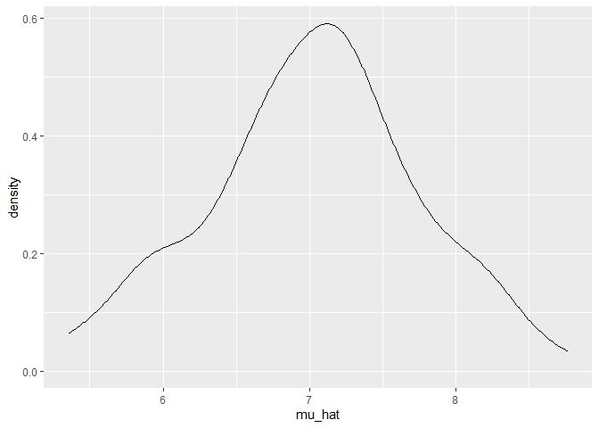
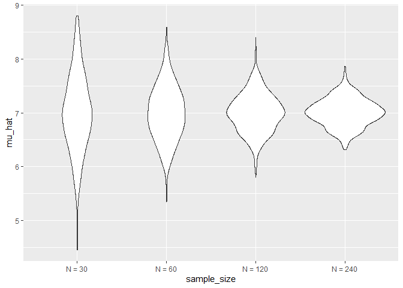
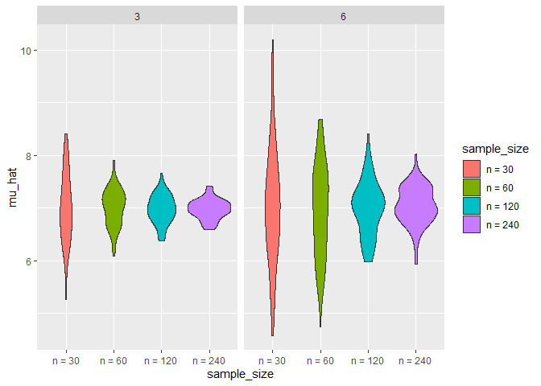

Simulation
================
Lectured by Jeff Goldsmith
2022-11-03

    ## ── Attaching packages ─────────────────────────────────────── tidyverse 1.3.2 ──
    ## ✔ ggplot2 3.3.6     ✔ purrr   0.3.4
    ## ✔ tibble  3.1.8     ✔ dplyr   1.0.9
    ## ✔ tidyr   1.2.1     ✔ stringr 1.4.1
    ## ✔ readr   2.1.2     ✔ forcats 0.5.2
    ## ── Conflicts ────────────────────────────────────────── tidyverse_conflicts() ──
    ## ✖ dplyr::filter() masks stats::filter()
    ## ✖ dplyr::lag()    masks stats::lag()

### Quick shorthand

-   `shift` + `option` and then select the big chunk that you want to
    delete.

repeat efgf repeat efgf repeat efgf repeat efgf repeat efgf

-   `ctrl` + `F` find the word that you want to change. Replace with the
    other words.

## Simulation: Mean and SD for one ***n***

Generating a sample mean from a normal distribution…

As usual, create a function first.

``` r
sim_mean_sd = function(n_obs, mu = 7, sigma = 4) {
  
    x = rnorm(n = n_obs, mean = mu, sd = sigma)
  
  tibble(
      mu_hat = mean(x),
      sigma_hat = sd(x))
}
```

Then, test if the function works properly.

``` r
sim_mean_sd(n_obs = 30)
```

    ## # A tibble: 1 × 2
    ##   mu_hat sigma_hat
    ##    <dbl>     <dbl>
    ## 1   7.34      4.18

If we run the above code 100 times, we will get 100 different values
every time. But we can use `for` *loop* or `map`!

``` r
output = vector("list", length = 100)
for (i in 1:100) {
  output[[i]] = sim_mean_sd(n_obs = 30)
}

# make the results look like a tibble:
bind_rows(output)
```

    ## # A tibble: 100 × 2
    ##    mu_hat sigma_hat
    ##     <dbl>     <dbl>
    ##  1   7.13      3.63
    ##  2   6.29      3.45
    ##  3   7.85      4.53
    ##  4   6.60      3.84
    ##  5   5.99      4.20
    ##  6   6.70      3.56
    ##  7   6.38      2.89
    ##  8   6.45      3.58
    ##  9   6.48      3.89
    ## 10   7.11      3.85
    ## # … with 90 more rows

We can also do list columns.

``` r
sim_results = 
  # I want to create a dataframe that has expanded rows that do the following:
  expand_grid(   # expand_grid is like tibble...
    sample_size = 30,  # I want a column for sample_size
    iteration = 1:100) %>%   # Another column for iteration, and the rows go from 1 to 100
  # Then create a new column that calculate mean and sd using the function we created.
  mutate(
    estimate_measures = map(sample_size, sim_mean_sd)) %>% 
  unnest(estimate_measures)
```

We can make a plot to look at the distribution of all the mean and sd.

``` r
sim_results %>% 
  ggplot(aes(x = mu_hat)) + 
  geom_density()
```

<!-- -->

``` r
# Uhmmmm... It kinda look like a "normal" distribution. If we increase the sample size or the number of repetition, it will look more symmetric.
```

#### What about changing the sample size?

I need to input a list with different sample sizes.

``` r
sim_results_2 = 
  expand_grid(   
    sample_size = c(30, 60, 120, 240), 
    iteration = 1:1000) %>%   
  mutate(
    estimate_measures = map(sample_size, sim_mean_sd)) %>% 
  unnest(estimate_measures)
```

``` r
sim_results_2 %>% 
# To create a violin plot, the x-axis cannot be a number, it has to be a factor.
  mutate(
    sample_size = str_c("N = ", sample_size), # I am changing how each observation looks like: Before is 30, now is N = 30, etc. Now they become character instead of numeric.
    sample_size = fct_inorder(sample_size)) %>% # fct_inorder is kinda like SAS order = data
  ggplot(aes(x = sample_size, y = mu_hat)) + 
  geom_violin()
```

<!-- -->

``` r
# By looking at the plot, I can tell that the mean is at around 7. As the sample size increases, the distribution becomes narrower, meaning standard error becomes smaller.
```

``` r
sim_results_2 %>% 
  mutate(
    sample_size = str_c("N = ", sample_size),
    sample_size = fct_inorder(sample_size)) %>% 
# To check that the standard error becomes smaller as sample size increases, we can do the following:
  group_by(sample_size) %>% 
  summarize(emp_st_err = sd(mu_hat))
```

#### **Two inputs**…

Here I want different sample sizes and different true standard
deviations.

``` r
sim_results_3 = 
  expand_grid(   
    sample_size = c(30, 60, 120, 240), 
    true_sigma = c(3, 6),
    iteration = 1:100) %>%   
  mutate(
    estimate_measures = 
  # Use "map2" because I am mapping two arguments.
  # If I don't explicitly tell R .x is sample size and .y is true sigma, R will think the second argument in the map refers to the second argument in the function, which in this case is the mean.
    # sigma is the third argument in the function.
      map2(.x = sample_size, .y = true_sigma, ~sim_mean_sd(n_obs = .x, sigma = .y))) %>%  # ~ tells R that .x and .y go into this function.
  unnest(estimate_measures)
```

Now make a plot to see how the distributions change in response to
different sample sizes and standard errors.

``` r
sim_results_3 %>% 
  mutate(
    sample_size = str_c("n = ", sample_size),
    sample_size = fct_inorder(sample_size)) %>% 
  ggplot(aes(x = sample_size, y = mu_hat, fill = sample_size)) + 
  geom_violin() + 
  facet_grid(. ~ true_sigma)
```

<!-- -->

### `cache`

The `cache = TRUE` argument in a code chunk can be helpful: When it run
the code one time, it will save the results. So when we knit the
document, it will not take super long time to rerun the code again. But
we must pay attention to that, especially when we change the code, it
will not recognize the changes.
